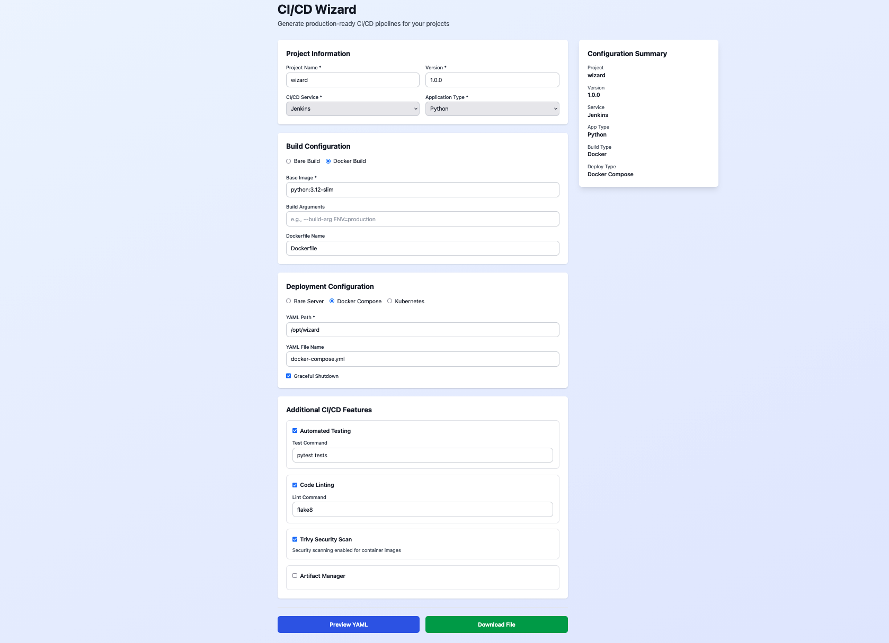
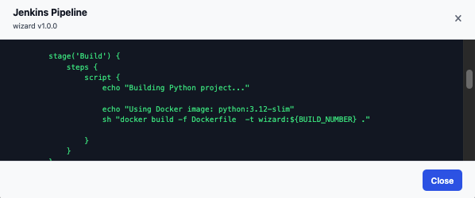

# CICD-Wizard

A powerful, user-friendly web application for generating CI/CD pipeline configurations. Choose your CI/CD service, application type, and deployment strategy, then let CICD-Wizard automatically generate optimized configuration files for your project.

## Overview

CICD-Wizard simplifies the process of setting up CI/CD pipelines by providing an intuitive web interface to configure and generate pipeline definitions. Instead of manually writing YAML files or configuration scripts, developers can use the wizard to specify their requirements and download ready-to-use configurations.

**Key Benefits:**
- **Quick Setup**: Generate CI/CD configs in minutes, not hours
- **Multiple Platforms**: Support for Jenkins and GitLab CI
- **Flexible Configuration**: Support for multiple programming languages and deployment strategies
- **Intuitive UI**: Clean, modern interface built with React
- **Easy Export**: Download generated configurations directly from the browser

## Features

### Supported CI/CD Services
- **Jenkins**: Generate Jenkinsfile and pipeline configurations
- **GitLab CI**: Generate `.gitlab-ci.yml` files

### Supported Application Types
- Python
- PHP
- Java

### Build Strategies
- **Docker Build**: Containerized builds with customizable base images and arguments
- **Bare Metal Build**: Direct language compilation with configurable version and build tools

### Deployment Options
- **Docker Deployment**: Using Docker Compose
- **Kubernetes Deployment**: With rolling updates and namespace isolation
- **Ansible Deployment**: For bare metal or VM deployments

### Additional Features
- Project versioning
- Configurable build commands
- Environment-specific settings
- YAML preview before download
- Responsive design

## Tech Stack

### Backend
- **Framework**: [FastAPI](https://fastapi.tiangolo.com/) 0.117+
- **Server**: [Uvicorn](https://www.uvicorn.org/) with optional [Gunicorn](https://gunicorn.org/)
- **Python**: 3.12+
- **Template Engine**: [Jinja2](https://jinja.palletsprojects.com/) for YAML generation
- **Validation**: [Pydantic](https://docs.pydantic.dev/) v2+

### Frontend
- **Framework**: [React](https://react.dev/) 18.2+
- **Language**: [TypeScript](https://www.typescriptlang.org/) 5.2+
- **Build Tool**: [Vite](https://vitejs.dev/) 5.0+
- **Styling**: [Tailwind CSS](https://tailwindcss.com/) 3.3+
- **HTTP Client**: [Axios](https://axios-http.com/)
- **Linting**: ESLint

## Prerequisites

### Backend
- Python 3.12 or higher
- uv or pip for dependency management

### Frontend
- Node.js 18+ and npm/yarn
- Modern web browser

## Installation

### Clone the Repository

```bash
git clone https://github.com/TheMainMamad/CICD-Wizard.git
cd CICD-Wizard
```

### Backend Setup

1. **Create and Install required Python packages:**
   ```bash
   uv sync
   ```

### Frontend Setup

1. **Navigate to the frontend directory:**
   ```bash
   cd frontend
   ```

2. **Install dependencies:**
   ```bash
   npm install
   ```

## Running the Application

### Development Mode

#### Backend

```bash
uv run python main.py
```

The API will be available at `http://localhost:8000`
- API Documentation: `http://localhost:8000/docs`
- Alternative docs: `http://localhost:8000/redoc`
- Health check: `http://localhost:8000/health`

#### Frontend

In a new terminal:

```bash
cd frontend
npm run dev
```

The frontend will be available at `http://localhost:3000` (Vite default)

### Production Mode

#### Backend with Gunicorn

```bash
gunicorn cicd_wizard.app:app --workers 4 --worker-class uvicorn.workers.UvicornWorker --bind 0.0.0.0:8000
```

#### Frontend

Build the production bundle:

```bash
cd frontend
npm run build
npm run preview
```

#### Build using Docker
```bash
docker build -t cicd-wizard-api:latest -f infra/docker/python.Dockerfile . --no-cache
docker build -t cicd-wizard-ui:latest -f infra/docker/node.Dockerfile frontend 
docker compose up -d
```

## Screenshots




## License

This project is licensed under the MIT License - see the [LICENSE](LICENSE) file for details.

## Contributing

Contributions are welcome! Please feel free to submit a Pull Request.

## Support

For issues, questions, or feature requests, please open an issue on the repository.
